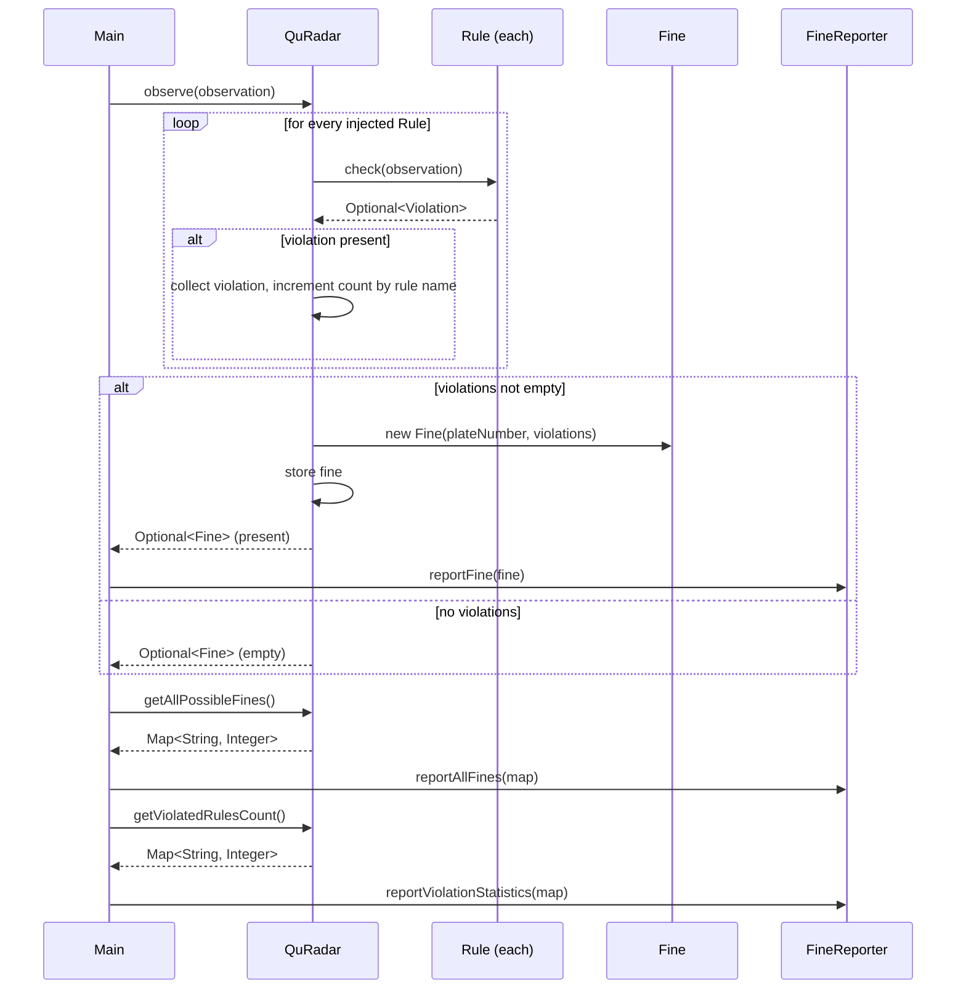

# Quantum Radar (QuRadar)

Java traffic-violation detection and fine system - takes radar observations, checks them against a set of rules, issues fines.

**AI Model used:** None. Deterministic, rule-based.

## Overview

QuRadar takes an observation (plate number, date, vehicle type, speed, seatbelt status), runs it through whatever rules are configured, and issues a fine if any rule is broken. It also keeps a running count of how often each rule gets violated.

Main classes:
- `Observation` - one snapshot from the radar, validates itself on construction
- `Rule` + implementations - each checks one traffic law
- `Violation` - one broken rule (name, description, fee)
- `Fine` - all violations for one car plus the total
- `QuRadar` - runs the rules, tracks fines/stats
- `FineReporter` / `ConsoleFineReporter` - prints results
- `RadarException` hierarchy - missing field vs invalid value vs bad rule
- `Main` - wires it all together and runs a demo

---
## Results and Observations:


---

## Architecture

```
┌───────────────────────────────────────────────────────────────┐
│                            Main                                 │
│     (composition root: wires rules + reporter, runs demo)       │
└───────────────────────────────┬─────────────────────────────────┘
                                  │ injects
                                  ▼
┌───────────────────────────────────────────────────────────────┐
│                          QuRadar                                 │
│  observe(Observation) : Optional<Fine>                          │
│  getAllPossibleFines() : Map<String, Integer>                   │
│  getViolatedRulesCount() : Map<String, Integer>                 │
│  ────────────────────────────────────────────────────────────  │
│  Depends ONLY on the Rule interface. Never prints. Never        │
│  instantiates a concrete rule.                                  │
└───────────────┬───────────────────────────────┬─────────────────┘
                 │                               │
                 ▼                               ▼
     ┌───────────────────────┐        ┌───────────────────────┐
     │        Rule             │        │         Fine           │
     │      <<interface>>      │        │  plateNumber           │
     │  check(Observation)     │        │  violations[]           │
     │  getName()               │        │  totalAmount            │
     └───────────┬───────────────┘        └───────────┬─────────────┘
                  │                                     │
   ┌──────────────┼───────────────┬────────────┐        ▼
   ▼              ▼               ▼            ▼    ┌───────────┐
Seatbelt      Private         Truck          Bus /   │ Violation │
 Rule       SpeedRule       SpeedRule    Motorcycle   │ ruleName  │
             (extends         (extends     SpeedRule  │ description│
            SpeedRule)        SpeedRule)  (extends    │ fee       │
                                            SpeedRule) └───────────┘

                                          ┌──────────────────────┐
                     QuRadar's results──▶ │     FineReporter      │
                                          │    <<interface>>      │
                                          │  reportFine()          │
                                          │  reportAllFines()      │
                                          │  reportViolationStats()│
                                          └───────────┬────────────┘
                                                        │
                                                        ▼
                                          ┌──────────────────────┐
                                          │  ConsoleFineReporter  │
                                          └──────────────────────┘
```

**Data flow:** `Main` builds the rule list and a `ConsoleFineReporter`, injects the rules into `QuRadar` → `QuRadar.observe()` loops every rule → each returns `Optional<Violation>` → all violations for that car become one `Fine`, returned to the caller → `Main` hands that `Fine` to the `FineReporter` if it wants it printed.

---

## Project Structure

```
Quantum Radar/
├── README.md
├── src/
│   ├── Main.java                          # Composition root / demo
│   │
│   └── radar/
│       ├── QuRadar.java                   # Orchestrator (observe, reports)
│       │
│       ├── model/
│       │   ├── VehicleType.java           # enum: PRIVATE, TRUCK, BUS, MOTORCYCLE
│       │   ├── Observation.java           # immutable, self-validating
│       │   ├── Violation.java             # one broken rule + fee
│       │   └── Fine.java                  # violations for one car + total
│       │
│       ├── exception/
│       │   ├── RadarException.java            # base type for all radar errors
│       │   ├── InvalidObservationException.java  # present but invalid value
│       │   ├── MissingFieldException.java     # required field was null/blank
│       │   └── InvalidRuleException.java      # bad Rule wiring into QuRadar
│       │
│       ├── rule/
│       │   ├── Rule.java                  # <<interface>> — the extension point
│       │   ├── SpeedRule.java             # abstract base shared by speed rules
│       │   ├── SeatbeltRule.java
│       │   ├── PrivateCarSpeedRule.java   # extends SpeedRule
│       │   ├── TruckSpeedRule.java        # extends SpeedRule
│       │   ├── BusSpeedRule.java          # extends SpeedRule
│       │   └── MotorcycleSpeedRule.java   # extends SpeedRule
│       │
│       └── report/
│           ├── FineReporter.java          # <<interface>> — presentation abstraction
│           └── ConsoleFineReporter.java   # prints to stdout
```

---

## Class Diagram


---

## Sequence Diagram



> `mermaid` blocks render natively on GitHub/GitLab and in most modern IDEs. The ASCII diagram under [Architecture](#architecture) is a plain-text fallback.

---

## Design notes

Tried to keep things loosely coupled while building this:
- `QuRadar` only knows about the `Rule` and `FineReporter` interfaces, never concrete classes - those get created and wired together in `Main`.
- Adding `MotorcycleSpeedRule` didn't require touching `QuRadar.java` at all, just the new file + one line in `Main`.
- Each class sticks to one job - `Observation` validates itself, `Rule`s just check one law, `Fine` aggregates, `QuRadar` orchestrates, `FineReporter` prints.

---

## Domain Rules

| Rule | Applies to | Condition | Fee |
|---|---|---|---|
| `SeatbeltRule` | Every vehicle | Seatbelt not fastened | 100 EGP flat |
| `PrivateCarSpeedRule` | `PRIVATE` | Speed > 80 km/h | 10 EGP per km/h over |
| `TruckSpeedRule` | `TRUCK` | Speed > 60 km/h | 15 EGP per km/h over |
| `BusSpeedRule` | `BUS` | Speed > 70 km/h | 12 EGP per km/h over |
| `MotorcycleSpeedRule` | `MOTORCYCLE` | Speed > 70 km/h | 8 EGP per km/h over |

Each rule is fully independent — `QuRadar` has no idea any of them exist beyond the shared `Rule` interface.

---

## Validation vs. Violations

These are two different things:

- **Bad input** (malformed plate, negative/unrealistic speed, future date, missing vehicle type) throws an exception when the `Observation` is constructed - it never even reaches a rule.
- **A broken traffic law** (speeding, no seatbelt) isn't an error, it's expected - it becomes a `Violation` and gets billed as part of a `Fine`.

| Field | Validation | On failure |
|---|---|---|
| Plate Number | Not null/blank, alphanumeric, 3–10 characters | `MissingFieldException` (null/blank) or `InvalidObservationException` (bad format) |
| Date | Not in the future | `null` is **not** an error — defaults to `LocalDateTime.now()`. Only a future date throws `InvalidObservationException`. |
| Vehicle Type | Not null | `MissingFieldException` |
| Speed | 0–300 km/h | `InvalidObservationException` |
| Seatbelt | Any boolean | No validation needed |

---

## Exception Handling

Every error the system can raise extends `radar.exception.RadarException` (itself an unchecked `RuntimeException`), so a caller can catch broadly with one type or narrowly with a specific one:

```
RadarException                        (base — "something in the radar system failed")
├── InvalidObservationException       (a value was present but not legal)
│   └── MissingFieldException         (a required field was null/blank; carries getFieldName())
└── InvalidRuleException              (QuRadar was given a null/unusable Rule)
```

A few notes on why it's split this way:

- Missing a field entirely (no plate sent) vs. sending a bad value (plate = "A") are different problems, so they get different exception types.
- A missing date isn't treated as fatal - it just defaults to `now()`. Plate and vehicle type don't have a sane default though, so those stay required.
- Everything's unchecked (`RuntimeException`) since a bad observation is a data problem to catch at the boundary, not something every method signature should have to declare.

`Main` shows catching each level of the hierarchy in its `=== Testing Exception Handling ===` output.

---

## Sample Output

Running `Main` produces, for the first observation (`Private car, 94 km/h, no seatbelt`), exactly the format the spec requires:

```
Traffic fine for car ABC1234
Total amount: 400 EGP
Violations:
- Seatbelt not fastened : 100 EGP
- speed of 94 exceeded max allowed 80 : 300 EGP
```

And the exception-handling demo output looks like:

```
Missing plate number (null) -> MissingFieldException
  Caught MissingFieldException (field: plateNumber): plateNumber is required but was missing

Invalid plate: 'A' (too short) -> InvalidObservationException
  Caught InvalidObservationException: Invalid plate number 'A': must be alphanumeric, 3-10 characters

Missing date (null) is NOT rejected - it defaults to now():
  Accepted with date defaulted to: 2026-07-23T11:42:07.123
```

---

## Build & Run

Requires JDK 11+ (tested on JDK 21).

```bash
# from the project root
javac -d out $(find src -name "*.java")
java -cp out Main
```

---

## Usage

```java
List<Rule> rules = Arrays.asList(
    new SeatbeltRule(),
    new PrivateCarSpeedRule(),
    new TruckSpeedRule(),
    new BusSpeedRule()
);

QuRadar radar = new QuRadar(rules);
FineReporter reporter = new ConsoleFineReporter();

Optional<Fine> fine = radar.observe(new Observation(
    "ABC1234", LocalDateTime.now(), VehicleType.PRIVATE, 94, false));

fine.ifPresent(reporter::reportFine);

reporter.reportAllFines(radar.getAllPossibleFines());
reporter.reportViolationStatistics(radar.getViolatedRulesCount());
```

---

## Extending the System

Adding a new rule never touches `QuRadar`. Example — a rule for emergency vehicles that are exempt from the speed limit but still need seatbelts checked separately isn't even necessary; but for a genuinely new law, e.g. taxis:

```java
package radar.rule;

import radar.model.VehicleType;

public class TaxiSpeedRule extends SpeedRule {
    public TaxiSpeedRule() {
        super(VehicleType.TAXI, 75, 9);
    }

    @Override
    public String getName() {
        return "Taxi Speed";
    }
}
```

Then wire it in wherever rules are assembled (`Main`, or any other composition root):

```java
radar.addRule(new TaxiSpeedRule());
```

`QuRadar.java` doesn't need to change at all for this.
